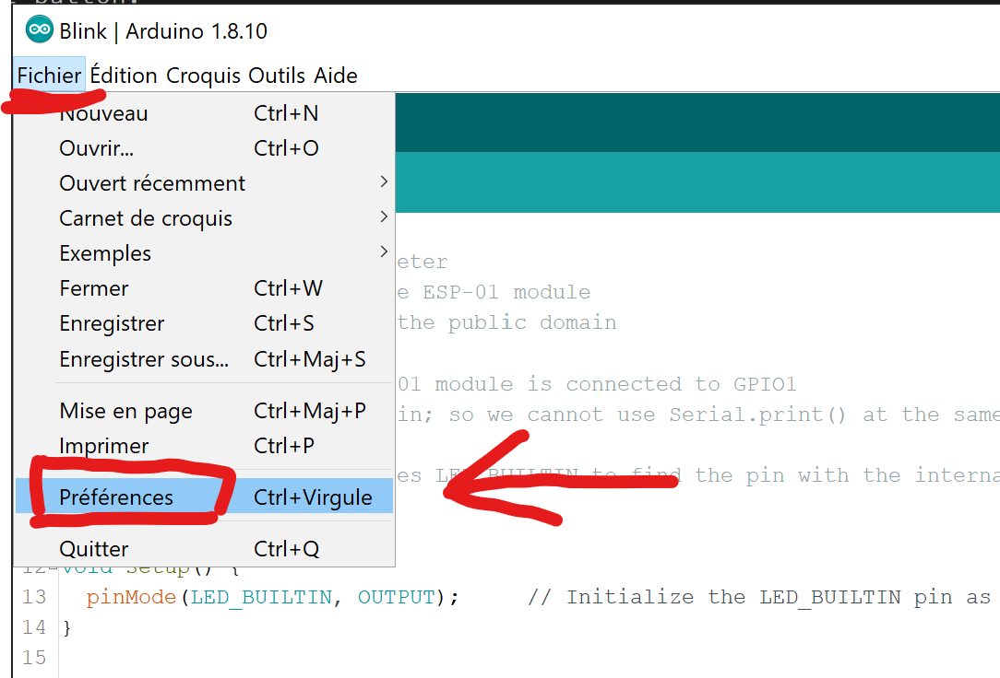
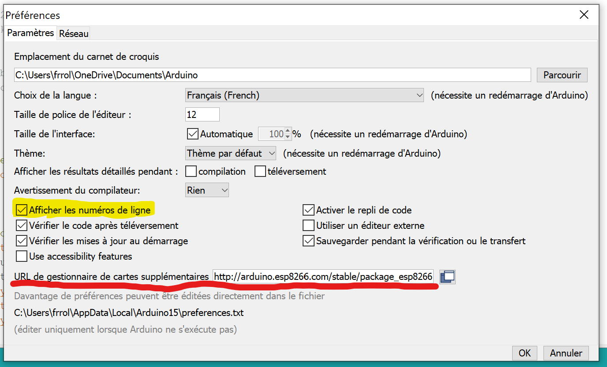
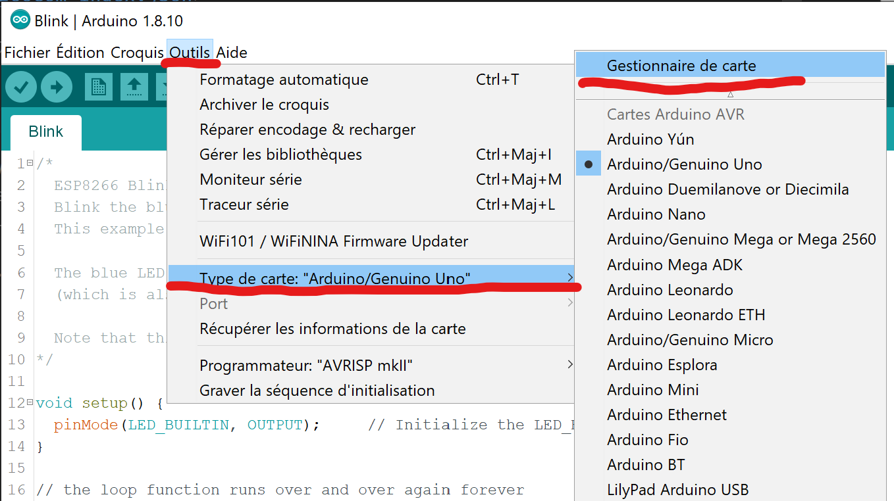
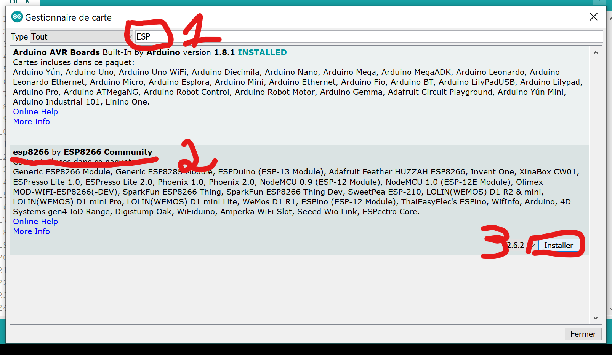
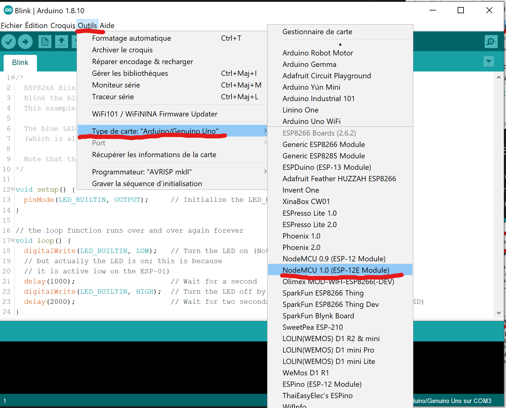
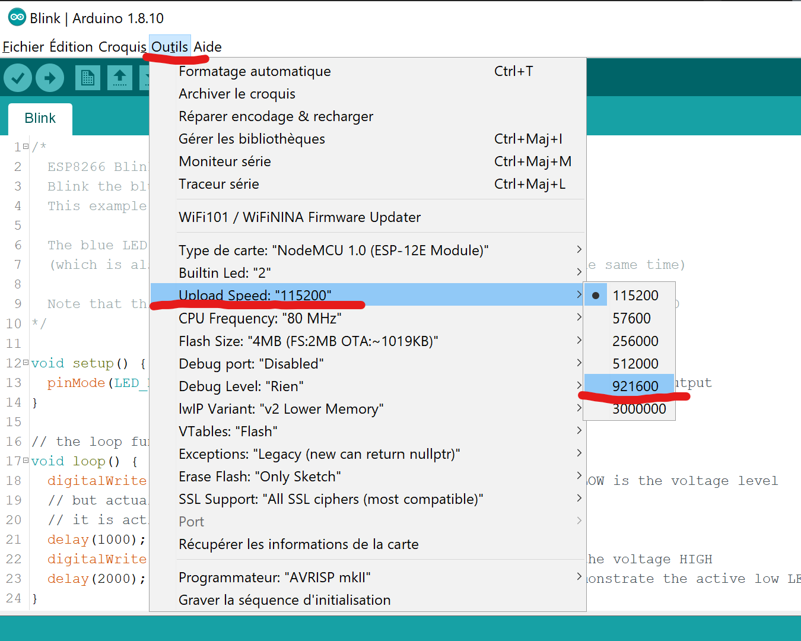

# Configurer un contrôleur ESP8266 sur l'IDE Arduino

## Démarrer Arduino et ouvrir aller dans les Préférences

## Ajouter une URL de gestionnaire de carte

URL à ajouter: **<https://arduino.esp8266.com/stable/package_esp8266com_index.json>**

_S'il y a déjà une URL, ajouter la nouvelle en les séparant par des virgules._

## Installer le gestionnaire de carte

## Installer la plateforme ESP8266

1. Entrer `ESP` comme texte de recherche
2. Repérer la plateforme `esp8266 by ESP8266 Community`
3. Cliquer sur le bouton `Installer`

## Sélectionner le micro-contrôleur

## Accélérer le téléversement

